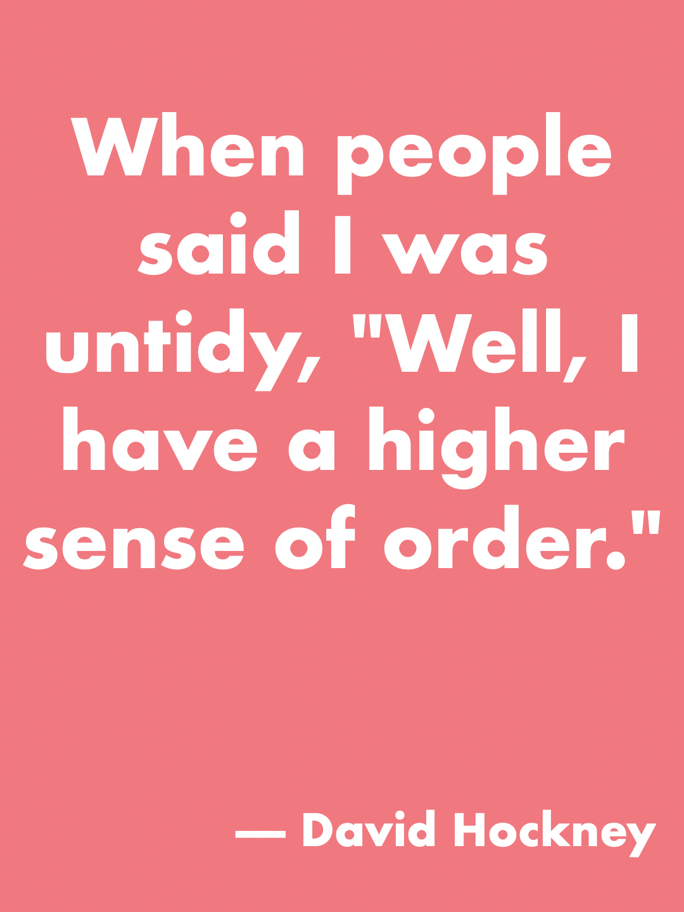
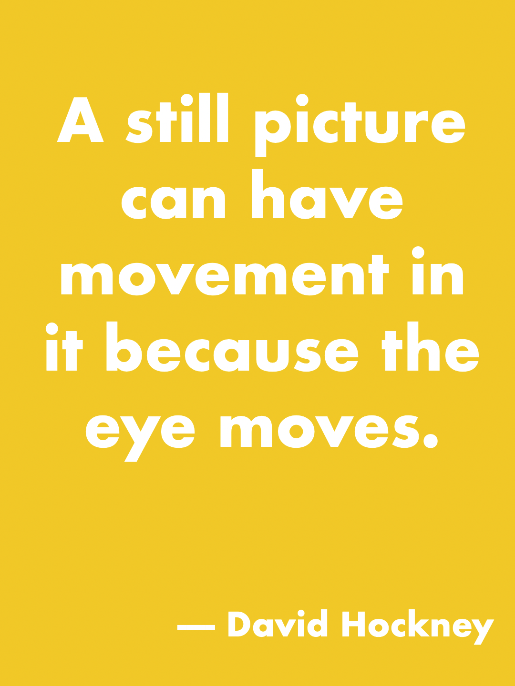
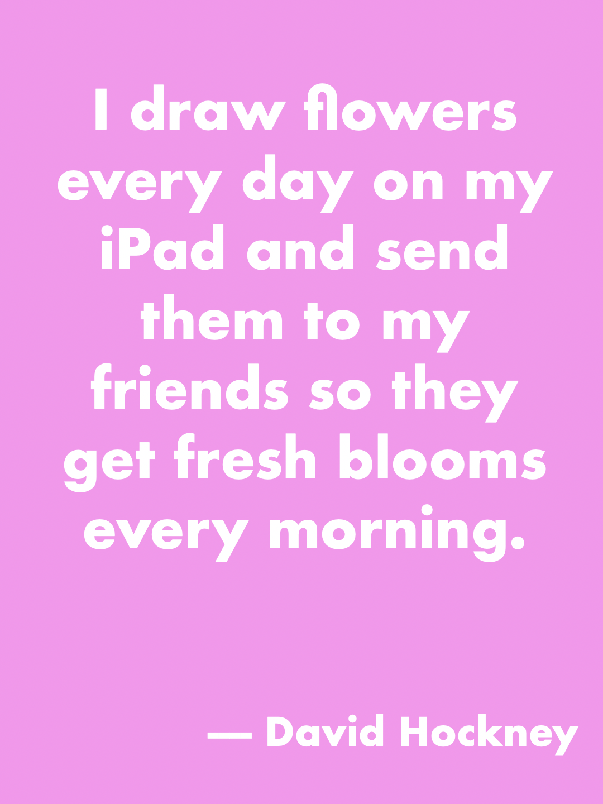
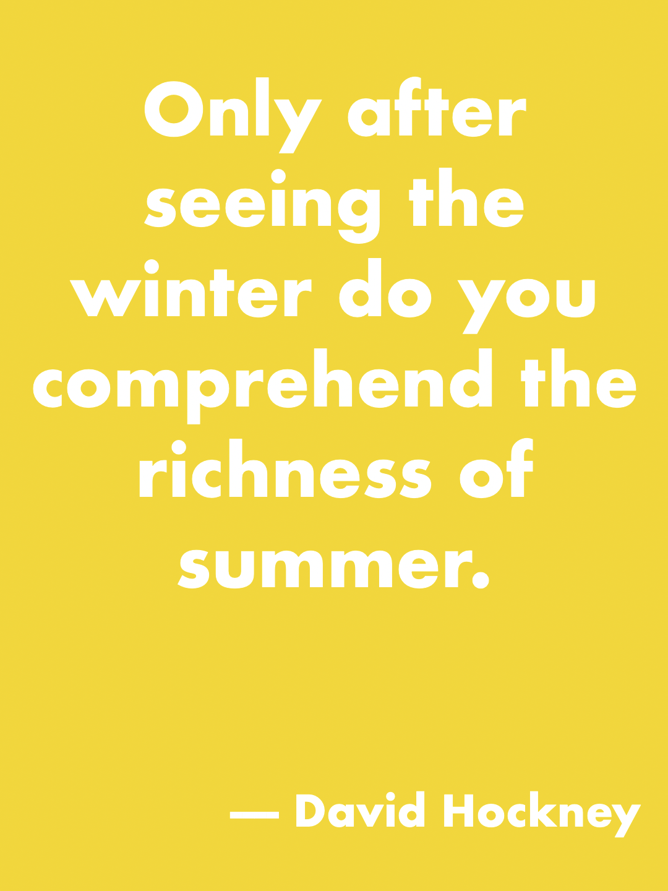
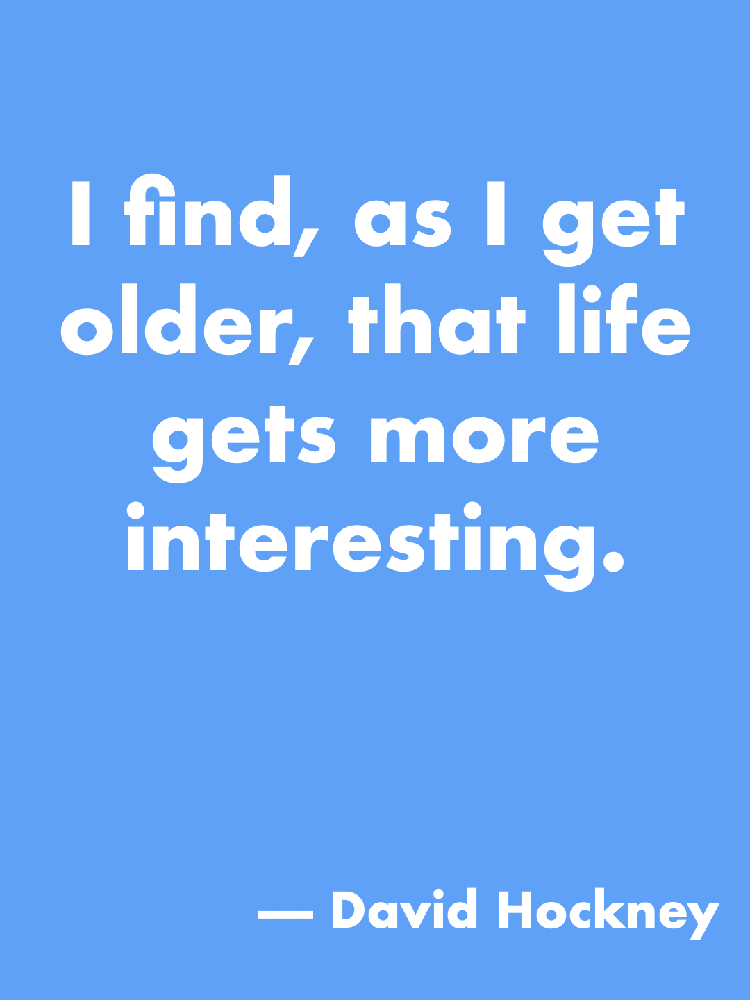
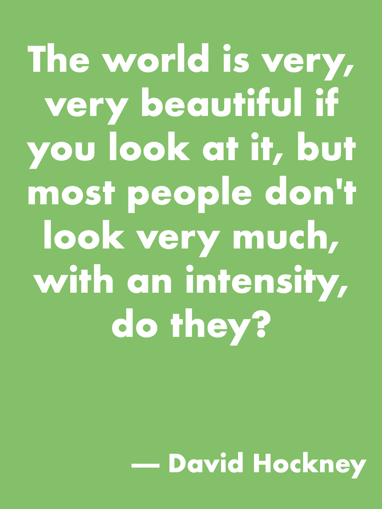

# Poster

**A tiny native macOS app for making beautiful posters.**

Pick a size, pick a color, add text — export as PNG. That's it.

<p align="center">
  
  
  
</p>

<p align="center">
  
  
  
</p>

## ✨ Features

- **Preset sizes** — Instagram (square, portrait, story), RedNote (小红书), Weibo, X (Twitter), and print-ready A-series & US Letter
- **Background color** — any color via the system color picker
- **Rich text** — choose font, size, and color; bold supported. Drag to move, corner-drag to resize. Text wraps inside the box
- **WYSIWYG export** — what you see in the editor is exactly what you get at full pixel resolution

## 📥 Installation

Go to **[Releases](https://github.com/woojooest/Poster-Generation/releases)** and download the latest `Poster.dmg`.

- Open the DMG, drag **Poster** to your Applications folder, and you're done.
- Requires macOS 13 or later.

## 🎨 Showcase

All posters above were created with Poster — inspired by David Hockney's bold, vibrant style.

## 🛠 For Developers

```bash
# Clone and open in Xcode
git clone git@github.com:woojooest/Poster-Generation.git
cd Poster-Generation
open Poster.xcodeproj
```

Requires Xcode 15+, macOS 13+.

## 📄 License

MIT
